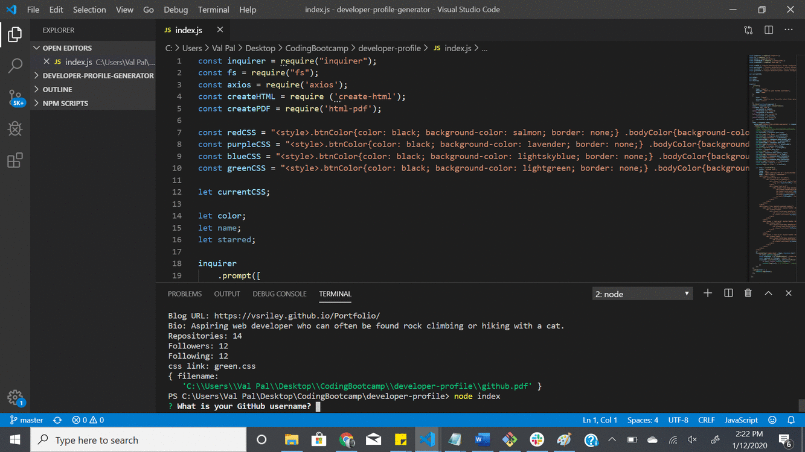

# developer-profile-generator

## Description 

This project was created to take a GitHub username and favorite color and generate a pdf that contains their corresponding GitHub information
in a color scheme that corresponds to the users favorite color. The pdf includes links to both the GitHub and blog site.

The biggest challenge I faced was attempting to use async and await to create this application. Eventually I was dealing with error after error
and ended up figuring a way to create the app without it.  In the future I will figure out a way to utilize async and await. In addition, I
will create more color options for the application and work to have an error show if the user inputs an invalid color.
Another challenge I faced was generating the pdf with proper formatting from the html.  Researching the errors I was finding, it seemed that
the Bootstrap grid system often has issues with translating from html to pdf. I was able to find ways around it with further css formatting
and changing all md formatting to xs. In addition, I switched from using an external css file to internal CSS.

## Installation

To utilize the project install inquirer, axios, create-html, and html-pdf and utilize node in the terminal.

## Usage 

The project takes a GitHub username and user's favorite color and returns a pdf file showcasing their GitHub information utilizing styling with their favorite color.

## Demo

## License

MIT License

Copyright (c) 2019 Valerie Riley

Permission is hereby granted, free of charge, to any person obtaining a copy
of this software and associated documentation files (the "Software"), to deal
in the Software without restriction, including without limitation the rights
to use, copy, modify, merge, publish, distribute, sublicense, and/or sell
copies of the Software, and to permit persons to whom the Software is
furnished to do so, subject to the following conditions:

The above copyright notice and this permission notice shall be included in all
copies or substantial portions of the Software.

THE SOFTWARE IS PROVIDED "AS IS", WITHOUT WARRANTY OF ANY KIND, EXPRESS OR
IMPLIED, INCLUDING BUT NOT LIMITED TO THE WARRANTIES OF MERCHANTABILITY,
FITNESS FOR A PARTICULAR PURPOSE AND NONINFRINGEMENT. IN NO EVENT SHALL THE
AUTHORS OR COPYRIGHT HOLDERS BE LIABLE FOR ANY CLAIM, DAMAGES OR OTHER
LIABILITY, WHETHER IN AN ACTION OF CONTRACT, TORT OR OTHERWISE, ARISING FROM,
OUT OF OR IN CONNECTION WITH THE SOFTWARE OR THE USE OR OTHER DEALINGS IN THE
SOFTWARE.